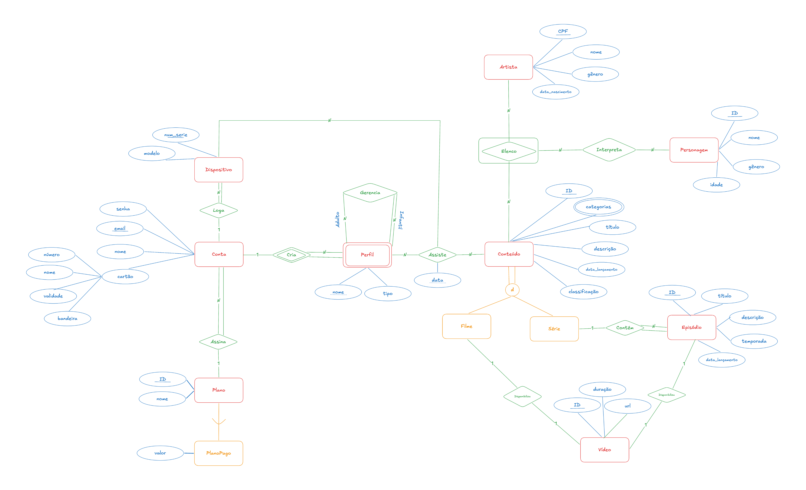
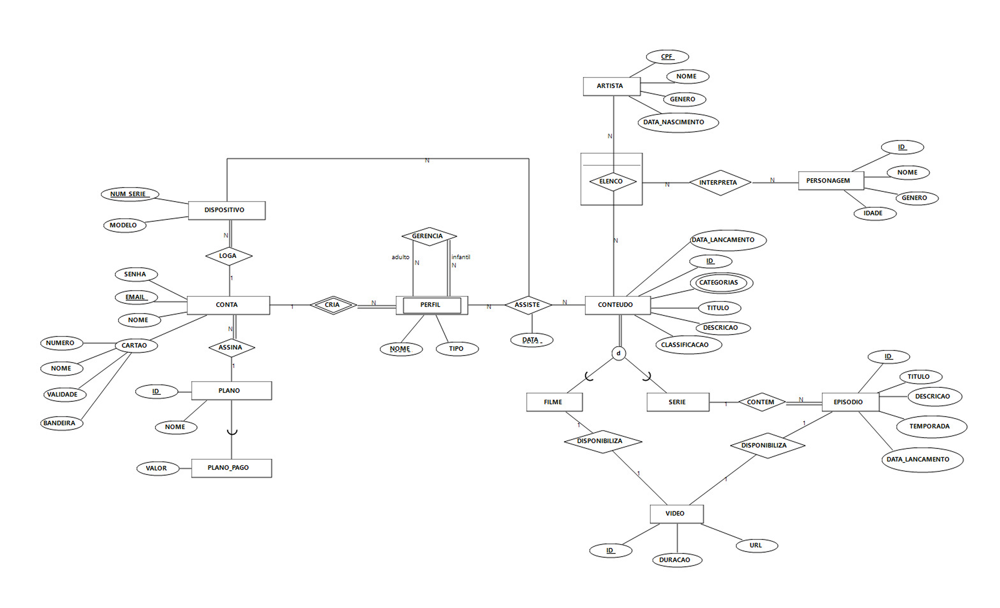

# 📚 Projeto de Banco de Dados

Bem-vindo ao repositório do projeto de Banco de Dados.  
Este projeto foi desenvolvido com o objetivo de aplicar conceitos de modelagem de dados e consultas SQL, passando pelas etapas de modelagem conceitual, modelagem lógica e manipulação de dados.Projeto desenvolvido para a Disciplina Banco de Dados - CIn UFPE

## 📌 Objetivo

Construir um banco de dados relacional completo, documentando:

- Modelo Conceitual
- Modelo Lógico
- Criação das tabelas
- Inserção de dados
- Consultas SQL

## 🧠 Modelo Conceitual

O modelo conceitual representa a estrutura inicial do sistema através de entidades, atributos e relacionamentos.

  
  

  
Recursos Utilizados no Modelo Conceitual

   

    - Atributo composto
    - Atributo multivalorado
    - Atributo discriminador em relacionamento

    - Relacionamento 1:1
    - Relacionamento 1:N
    - Relacionamento N:M
    - Relacionamento parcial-total
    - Relacionamento parcial-parcial
    - Relacionamento Unário ou Auto Relacionamento
    - Relacionamento Identificador ou Entidade Fraca 
    - Relacionamento Binário
    - Relacionamento N-ário 
    - Entidade Associativa
    - Herança (qualquer tipo)

    - Atributos do tipo numérico, data e texto.

## 🗄️ Modelo Lógico

O modelo lógico converte o modelo conceitual em tabelas relacionais.

  
Recursos Utilizados no Modelo Lógico

   
  
    - Mapeamento de entidades regulares e seus atributos
    - Mapeamento de entidades fracas e seus atributos
    - Mapeamento de super/subentidades e seus atributos
      - Uma relação para cada entidade da herança
      - Uma única relação para toda herança disjunta ou direta
    - Mapeamento de entidades associativas

    - Mapeamento de relacionamentos e seus atributos
      - Adição de chave estrangeira
      - Criação de relação

## 💻 Consultas SQL

As consultas SQL se  rão utilizadas para manipulação e extração de dados.

### Consultas implementadas
- `Group by/Having`
- `Junção externa`
- `Semi junção`
- `Anti-junção`
- `Subconsulta do tipo escalar`
- `Subconsulta do tipo linha`
- `Subconsulta do tipo tabela`
- `Operação de conjunto`
